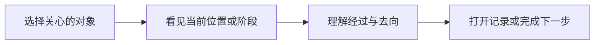

# 薯条杯设计系统 · FC Signal

版本：1.1

日期：2026-09-10

定位：官网与赛事中心共同使用的品牌及设计原则；FryDeck overlay 为次要的转播延伸参考。

核心主张：**把玩家共同创造的比赛，做成值得走进、能够读懂、愿意留下的赛事档案。**

本文规定设计方向和判断方法；具体页面是否实现、通过验收或正式上线，分别记录。2026-09-09 的升级只改变文档，不代表网站已更名或完成视觉迁移。

## 1. 文档层级与命名

| 层级 | 文档 | 回答的问题 |
| --- | --- | --- |
| 品牌与跨产品原则 | 本文 | 薯条杯表达什么；各产品如何共享视觉语言；什么时候采用哪种表达 |
| 赛事中心实施规范 | [赛事中心设计与实现规范](fries-cup-data-signal-design-system.md) | 页面模式、字体与颜色变量、组件、路由、响应式、状态和动效如何实现 |
| 专题与交付记录 | 各页面设计文档、带日期的复核与交付记录 | 某个页面如何落地；当次实际检查了什么；哪些工作仍待完成 |
| 素材记录 | [设计素材使用记录](design-material-policy.md)及具体资产清单 | 素材来源、用途与归属依据 |

品牌语义以本主文档为基准；赛事中心的数值、组件和交互契约以实施规范为基准。专题文档补充具体场景，不重新定义黄色、状态、导航或数据含义。带日期的检查记录保留历史事实，不能覆盖更新后的设计决定。

- 母品牌：**薯条杯 / FRIES CUP**。
- 官网：对外介绍薯条杯、社区与参与方式，产品身份可标注 `OFFICIAL SITE`。
- 原数据网页：中文名称统一为 **薯条杯赛事中心**，短称 **赛事中心**。
- `FRIES CUP DATA CENTER` / `DATA CENTER` 是现有英文标识；英文更名及字标组合需在命名交付中单独明确。本版只确认上述中文名称，不把工作译名写成已确定的英文品牌。
- **FC SIGNAL** 是内部设计语言名称，不替代用户看到的产品名称。
- `Data / Signal`、`FD / 05`、`kpr5` 等属于历史稿或兼容标记，不能成为正式产品身份。

本文保存在赛事中心仓库，作为跨产品原则的单一入口。官网或转播文档需要引用时链接到这里；具体组件继续由各产品维护，不复制第二份相互独立的品牌规范。

## 2. 品牌核心：共同参与，持续留下记录

薯条杯的内容中心是共同把比赛做成的人。选手和队伍带来比赛，赛管、导播、解说、设计和开发让比赛发生，观众一起见证；设计要让这些参与有身份、有经过、有记录。

每个页面在构图前明确三件事：

1. **谁是主角**：社区、某届赛事、某支队伍、某位参与者，或用户当前的任务。
2. **用户需要理解什么**：参与方式、当前赛况、晋级去向、赛季经历或具体数据。
3. **下一步去哪里**：加入、查找、选择、进入比赛、查看档案或完成操作。

归属感来自玩家名字、队伍经历、幕后署名与实际参与入口。英雄图提供游戏识别；薯条杯标志、赛事代码、真实人物关系和连续记录积累品牌自身的识别。

## 3. 产品分工与页面表达

| 场景 | 首要任务 | 推荐表达 | 用户应尽早看到 |
| --- | --- | --- | --- |
| 官网 | 认识薯条杯并找到参与方式 | 社区海报、人物群像、章节与票券式邀请 | 品牌主张、参与者和入口 |
| 进行中的赛事总览 | 掌握当前赛事并继续浏览 | Index 为主，保留一个品牌焦点 | 当前阶段、下一场或正在进行的比赛、主要入口 |
| 归档赛事总览 | 记住赛季和参与者 | Archive：冠军群像、人物镜头、赛季图谱 | 赛事身份、冠军或已发布结论、档案入口 |
| 晋级形势 | 理解一支队伍的去向及依据 | Index：阶段轨道、选队路径、排名和比赛记录 | 阶段、当前选择、位置与后续去向 |
| 名单、赛程、排行 | 查找和比较 | Index：清晰行列、筛选、固定数字对齐 | 可用的查找方式和真实结果 |
| 人物、队伍与赛季故事 | 看懂身份和经历 | Archive；分析区采用 Index 的密度 | 身份、数据范围、关键经历及证据入口 |
| 账户、报名、比赛房 | 完成当前任务 | Control：状态、权限、截止时间和反馈 | 当前任务、可执行动作及阻塞原因 |
| FryDeck overlay | 让观众迅速识别现场情况 | 转播画面：比分、双方身份、当前状态 | 当前比赛或待命状态、关键信息 |

Archive、Index、Control 是赛事中心的三种任务模式，不要求官网变成数据工作台。FryDeck overlay 提供转播层级和现场感；其控制台布局、硬件参数、频道代码与持续发光效果不构成官网或赛事中心的默认规范。FryDeck 自定义赛事主题也不重新定义薯条杯品牌色。

### 3.1 同级目录：共同框架，内容各有重点

2026-09-10 的方向确认以选手目录为视觉基准：用户既要快速找到对象，也愿意停下来认识对象。选手、队伍、职员三个同级目录共享标题、查找方式、名单密度、选中反馈和预览位置。纸色名单承担查找，墨黑预览突出当前对象，黄色定位选择和主要档案入口。

桌面采用左侧名单、右侧档案预览；手机采用名单优先、在选中项下方展开预览。切换目录不应重新学习筛选、展开或进入档案的方法。差异主要来自真实内容：选手以本人身份和有记录的英雄为主，队伍以队徽与完整阵容为主，职员以姓名、公开头像或所属队伍及参与记录为主。

增加新页面时先复用同级模板，再安排对象的内容重点；不单独改变左右顺序、筛选位置、列表语法或主操作样式。该决定确认设计方向；本地实现、浏览器验证和最终视觉认可分别记录，不能相互替代。具体规则见[目录共同模板](fries-cup-data-signal-design-system.md#目录共同模板)。

## 4. 共同视觉语言

### 4.1 纸色、墨黑与黄色各有职责

纸色承载可阅读、可收藏的记录；墨黑建立人物舞台、关键局势和工作区；黄色引导当前关注、选择或主要去向。纸纹只增加轻微材质感，不能降低正文或细线的清晰度。

| 角色 | 官网现有值 | 赛事中心现有值 | 设计要求 |
| --- | --- | --- | --- |
| 品牌黄色 | `#f4c320` | `#f4c320` | 共享的识别与注意力信号 |
| 纸色 | `#eae7df` | `#eeede6` | 允许与内容密度相适应的暖灰差异 |
| 墨黑 | `#191b18` | `#181a17` | 稳定的主文字、舞台与结构色 |

这些色值来自当前样式文件；官网与赛事中心保持同一家族的表面关系，不据此要求各产品所有中性色数值完全相同。赛事中心的状态色、文字色和对比度配对见实施规范。

黄色面积由场景决定：

- 官网参与章节可使用整块黄色舞台，把注意力集中到加入和参与。
- 归档页可用一张黄色人物或冠军卡作为唯一重点；人物与成绩仍需有明确关系。
- 晋级图用黄色突出当前选择的真实路线；颜色不替代胜负、待定和淘汰说明。
- 名单、表格和操作页用黄色定位当前项及主操作，避免连续的大黄底消解层级。
- 完成、错误、警告、同步、归档与实时使用明确的状态表达；不能只给它们同一个黄色标签。

### 4.2 大字定调，小字定位，数字解释

- 厚重中文承担主要意思；窄高英文与数字用于场景标题、比分、排名和关键数值。
- 页码、赛事代码、短栏目名和细分隔提供秩序，不能形成第二套抢眼的标题。
- 默认阅读顺序为：核心表达 → 人物或对象 → 关键事实 → 详情入口。查询及操作页优先让结果或任务出现。
- 每个视口有一个主焦点。巨型背景字只承担装饰，不能重复播报或挤占内容。
- 中文是中文界面的主要信息；英文短标签可以补充栏目识别，不能让用户依靠解读技术代码理解操作。
- 重要状态、时间、单位与操作不能缩成装饰小字。具体字号和数字对齐规则由实施规范约束。

### 4.3 严格网格中保留海报的自由

页面共享清晰的边距、对齐线、间距节奏与分隔方式。官网的倾斜海报、纸张叠放和票券，以及总览中越出边界的人物，都需要有可辨认的对齐基准。

| 图形或构图 | 适合的职责 | 使用边界 |
| --- | --- | --- |
| 直角面板、细线、编号 | 记录、索引、分区和顺序 | 数据行与操作区保持稳定，不倾斜 |
| 切角、纸张叠放、轻微倾斜 | 官网邀请、收藏卡、少量档案焦点 | 不把所有卡片和控件都做成票券 |
| 十字定位点、边框角标 | 提示版面边界或对齐 | 保持低对比，不模拟无意义读数 |
| 轨道、箭头、连接线 | 阶段、关系、晋级和下一步 | 线的方向与状态必须能被解释 |
| 圆环、核心图谱 | 围绕赛事身份组织相关内容 | 不虚构实时雷达、进度或统计含义 |
| 人物越界与群像 | 唯一主角、团队和人物之间的切换 | 不遮挡身份、比分、筛选或操作 |

### 4.4 让图像对应真实身份

人物图与姓名、队伍、职责或赛事经历建立直接关系；队徽保持比例和原有颜色。冠军群像应保留队伍身份与完整成员入口，不能让缺少大图的替补或幕后人员从记录中消失。

展示英雄、常用英雄与某场比赛实际使用的英雄是不同含义；只有相应记录支持时才能互相对应。人物素材缺失时使用明确的身份回退，不以无关英雄图代替事实。素材来源与归属继续引用现有素材记录，本设计规范不新增授权结论。

## 5. 路径是共同的交互特征

用户先选择关心的对象，再看到它的位置、经过和去向，最后能够打开相应记录。这条关系可以用于晋级、队伍历程、选手赛季经历和参与流程；各场景仍需遵守自己的业务含义。

路径设计应满足：

1. 选中对象的名称、图中高亮和详细记录一致；切换对象后相关信息一起更新。
2. 已发生路径由真实比赛或操作记录支持。尚未发生的去向需标注待定、条件或待安排，不画成已经走过。
3. 颜色之外提供线型、节点标签和文字结果。双败赛制的落位与单败赛制的止步分别解释。
4. 总图帮助理解整体关系；局部摘要帮助读懂当前对象。手机可以先显示纵向摘要，再提供必要的完整横向图。
5. 进入比赛或档案后，返回应保留有意义的赛季、阶段、筛选和选择上下文。

官网章节与赛事图谱可以借用这种方向感；普通按钮和短表单不必为了品牌而增加路线图。

## 6. 文案、叙事与真实数据

文案从具体参与、具体人物和实际经历出发。官网可以更有邀请感；档案页可以表达记忆；数据与操作页应直接说明范围、结果和下一步。

| 场景 | 可采用的表达方式 | 必须同时成立的事实 |
| --- | --- | --- |
| 社区邀请 | 用简短中文说明可以如何参与 | 入口确实可用；筹备中的活动明确标注 |
| 冠军或人物档案 | 人物、荣誉和关键比赛构成一个焦点 | 荣誉来自已发布记录，人物身份可核对 |
| 队伍历程 | 用胜负和阶段串联经历 | 不推断未经证明的逆转、绝境或统治力 |
| 晋级形势 | 先说明去向，再提供排名与逐场依据 | 已确定、条件性去向与未知状态可区分 |
| 当前任务 | 直接说明状态、期限和可执行动作 | 权限与业务状态真实，失败有恢复方式 |

- 缺失不是零，未知不是未发生；未开赛、轮空、弃权、取消与正式完成分别表达。
- 数据范围、评分口径和有效样本不能被大标题隐藏。官方荣誉不由统计榜首自动推定。
- 归档时间、快照时间、最近同步结果和实时比赛状态是不同信息。
- 页面上的数据变化不自动说明上游已成功更新；缓存仍可阅读时说明其时间与范围。
- 海报、分享图、赛季回顾和网页应使用一致的身份、比分、荣誉与状态；版式变化不能改变含义。

## 7. 动效、声音与阅读节奏

动效说明对象切换、章节关系、路径变化和操作反馈。静止状态下，身份、核心事实和主要入口仍然成立。

| 场景 | 适合的变化 | 强度边界 |
| --- | --- | --- |
| 官网与档案主场景 | 人物入场、纸张层次、用户驱动的章节转换 | 一个持续场景即可；提供直接入口与减少动效方式 |
| 晋级图、筛选和名单 | 选中变化、路径高亮、局部展开 | 尽快反馈，不等待完整叙事动画才能读取结果 |
| 账户与操作区 | 状态更新、按钮反馈、错误定位 | 不使用视差或持续场景动画 |
| 转播 overlay | 场景切换、比分和状态变化 | 观众一眼识别优先；不把转播循环直接搬到网页 |

声音作为产品自身可控制的体验，不成为理解内容的唯一途径。官网现有声音功能不是赛事中心新增背景音乐的要求。减少动效时应直接呈现最终内容，并停用持续位移和视差；网页具体时长与交互规范见实施文档。

## 8. 跨赛季稳定，按设备重新构图

约 80% 为长期基础，约 20% 为赛季表达。这是设计取舍原则，不是逐像素计算的配额。

| 长期保持 | 赛季可以变化 |
| --- | --- |
| 品牌标志、字体职责、网格与导航习惯 | 人物、队伍、奖杯或其他适用主视觉 |
| 黄色及状态含义、组件结构与返回逻辑 | 章节文案、辅助纹理与适度氛围色 |
| 数据范围、身份与荣誉语义 | 该届赛事真实的经历、主题和记录 |
| 可读性、响应式和减少动效规则 | 与真实内容相符的叙事顺序 |

手机重新安排内容优先级：官网保留品牌表达与参与入口；人物页尽早出现身份；查询页尽早出现筛选和结果；操作页尽早出现任务。复杂签表和比较表可保留必要的内部滚动，文档外层不能因此溢出。页头、章节轨和状态栏不能一起占满首屏。

## 9. 现有页面实例与参考层级

下表记录 2026-09-09 本任务前序的实际观察，用于解释规则来源。示例是可借用的设计关系，不表示每个细节已经通过完整验收。

| 示例 | 观察到的组合 | 可复用的设计关系 |
| --- | --- | --- |
| [官网主场](https://fries-cup.com/#explore)与[群像](https://fries-cup.com/#people) | 纸色与墨黑切换、巨型中文、参与者卡片 | 先建立共同身份，再展开各自参与 |
| [官网记录](https://fries-cup.com/#records)与[参与](https://fries-cup.com/#participate) | 档案纸张、黄色舞台、票券式入口 | 从值得留下的经历，引向下一次参与 |
| 本机新版赛事总览 | 冠军群像 → 人物镜头 → 赛季图谱及比赛入口 | 从团队进入具体的人，再进入真实记录 |
| 本机新版瑞士轮 | 切换 AIP / MASK 后，黄色路线与逐轮记录对应变化 | 当前对象、整体路径和具体依据共同响应 |
| 本机新版季后赛 | 队伍身份卡、胜负路径、明确的决赛终点 | 把复杂赛制组织成可读的队伍经历 |
| FryDeck 本机构建的待命 overlay | 当前状态、大字、固定信息区与转播层级 | 快速识别现场情况；只作次要延伸参考 |

参考顺序为：用户任务及真实赛事内容 → 官网与新版总览、晋级形势中已形成的薯条杯语言 → FryDeck overlay 的适用信息层级 → 解决具体问题所需的外部结构参考。

早期 KPR、Marathon、终末地等研究解释章节、对比和网格的探索来源，保留在[历史设计预览](kpr-design-preview.md)等资料中。后续评审直接说明薯条杯页面的主角、关系和使用效果，不以像某个外部作品为合格标准，也不复制其品牌资产。

观察范围：官网为线上页面；[线上赛事页](https://stats.fries-cup.com/)当时仍显示旧版，FC Signal 总览和晋级来自本机 `127.0.0.1:3026` 的 `design=kpr5` 预览。预览显示数据更新失败并保留旧记录，因此这里不确认数据新鲜度。FryDeck 仅查看待命画面，并读取对阵、赛果样式，未开展实际转播验收。进行中赛事、全语言、手机矩阵及正式更名均不属于这次观察的完成结论。

## 10. 设计评审与交付

评审沿用户的阅读和操作顺序进行；先判断内容是否成立，再检查视觉与技术细节。

| 检查项 | 合格表现 | 需要调整的信号 |
| --- | --- | --- |
| 品牌与身份 | 能认出薯条杯、当前产品和赛事或对象 | 只剩外部参考风格；旧产品名与新名称混用 |
| 主角与焦点 | 一个明确主焦点，身份或结果尽早出现 | 巨型字、主图、多个摘要同时抢占首屏 |
| 色彩职责 | 纸、墨、黄有清楚分工；状态独立 | 所有重点都用黄色，实际状态无法区分 |
| 信息与路径 | 选择、路线、详情和返回相互对应 | 线条只是装饰，进入详情后丢失上下文 |
| 数据与叙事 | 结论有来源，未知与例外明确 | 将推测写成荣誉、将缺失写成零或未开赛 |
| 设备与语言 | 重新构图后仍可读、可选、可操作 | 依赖缩小字号，页头遮挡内容或外层溢出 |
| 动效与反馈 | 静止可读，操作及时，减弱动效有效 | 必须等待动画或声音才能理解内容 |
| 分享与跨产品 | 网页、分享产物和跳转目标保持同一身份与事实 | 只修改网页，图片或官网入口仍指向旧说法 |

每次交付说明采用的模式、借用的具体页面关系、实际改动范围及检查证据。文档、静态样板、本机功能、浏览器流程、导出产物与生产验证分别记录。纯文档更新检查术语、链接、规则冲突与差异范围；页面实现再按实施规范执行相应验证。

赛事中心更名落地时应一起核对全局字标、导航与官网入口、页面标题及元信息、可访问名称、加载和错误文案、分享与导出产物。现有 URL、仓库名称、样式前缀和 API 标识不因文档更名自动迁移。

## 11. 实现与资料入口

- [赛事中心实施规范](fries-cup-data-signal-design-system.md)：具体数值与组件的唯一实施入口。
- [赛事中心颜色与字体变量](../src/styles/fries-cup-data-system.css)、[基础字体变量](../src/styles/tokens.css)。
- [新版总览](../src/features/kpr-design/KprImmersiveArchive.jsx)、[总览样式](../src/features/kpr-design/KprImmersiveArchive.module.css)。
- [瑞士轮路径](../src/components/advance/AdvanceSignalSwiss.jsx)、[季后赛路径](../src/components/advance/AdvanceSignalPlayoffs.jsx)、[晋级页样式](../src/components/advance/AdvanceSignal.module.css)。
- [官网主场页面](../../fries-cup-official-site/docs/design-lab/homeground/index.html)、[官网基础样式](../../fries-cup-official-site/docs/design-lab/homeground/style.css)、[官网字标与标志组合](../../fries-cup-official-site/docs/design-lab/homeground/brand-header.css)。
- [FryDeck 对阵样式](../../frydeck/src/scenes/matchup/MatchupScene.module.css)、[赛果样式](../../frydeck/src/scenes/result/ResultScene.module.css)。

跨仓库源码链接按 `FriesCup/` 下的同级目录组织；独立检出时参考对应仓库的同名文件。页面样板保留历史代码路径，路径名称不代表对外品牌。

## 12. 版本记录

| 日期 | 版本 | 变化 |
| --- | --- | --- |
| 2026-09-09 | 1.0 | 建立品牌主文档；以官网及新版总览、晋级为主要依据；明确赛事中心中文命名、产品分工、视觉职责、路径交互、真实叙事与设计验收；FryDeck overlay 保持次要参考 |
